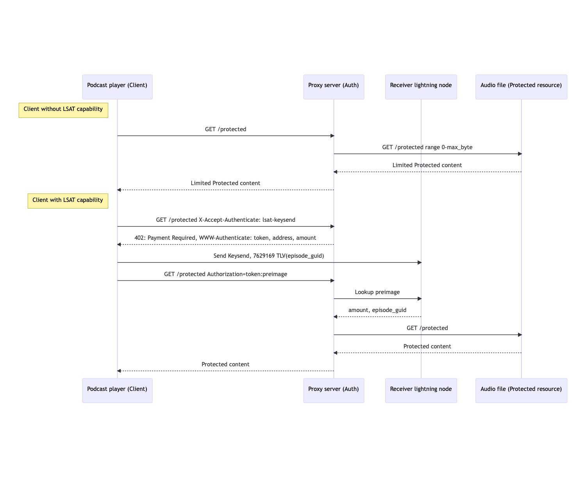

# Introducing the Open Content Payment Spec (OCPS)

## State of this spec

The OCPS is in an early "Request for Comments" state. Contribute to the discussion [on GitHub](https://github.com/Conshax/OCPS).\


## Motivation

The current state of paid audio content, especially for podcasting, has three central problems:

1. **Accessibility**: Paid content is not available in podcast players and needs to be accessed using external services and imported manually into a podcast player by each user.
2. **Visibility**: As paid content is not visible in the public podcast feed, podcasters do not have a native way to inform listeners about the existing paid content, which forces them to rely on alternative communication methods like social media.
3. **Payment**: Poor accessibility and visibility make one-time payments in the sense of "pay-per-listen" infeasible. Therefore, most existing models for paid content rely on subscriptions that require high commitments from podcasters and listeners.

We propose a novel solution based on the LSAT protocol that embeds paid content into public podcast feeds which can be accessed by sending keysend payments.

This solution makes content visible to everybody, easily accessible and can be integrated with a few lines of code because it relies on the HTTP protocol. It is also fully backwards compatible with clients that don't support LSAT.


## Concept

[LSAT](https://lsat.tech) (= Lightning Service Authentication Token) is a protocol for "authentication and paid APIs". In essence, the protocol protects resources requested via HTTP by validating a payment made by the requestor that qualifies him/her to access a specific resource. The protocol can be used to protect an entire resource or only parts of it.&#x20;

To prove the right to access a resource, the requestor includes a proof of payment in the request to the server. If no proof of payment is attached, the server responds with HTTP status code 402 "payment required" and the payment information. In the original protocol, Lightning invoices are used for payments. &#x20;

To make it work seamlessly with the current [Podcasting 2.0](https://github.com/Podcastindex-org/podcast-namespace/blob/main/docs/1.0.md) value tags, we propose a slight extension to allow the use of keysend payments in addition to the use of bolt11 invoices. This design decision is driven by the popularity of [Value4Value](https://value4value.info) payments, which rely on value tags as well as keysend payments and are integrated by a number of popular podcast players such as Breez, Fountain, Podverse and Castamatic. Using these established mechanismseases the integration and ensures compatibility with Value4Value.\


### LSAT protected episodes in the podcast feed&#x20;

A podcast episode / audio file protected by LSAT is listed in a podcast's RSS feed (or anywhere else) just like a regular podcast episode. We use Podcasting 2.0's value tags to define the payment recipients on an episode level. The "suggested" amount defines the **minimum** price to be paid for the content:

```rss
<podcast:value type="lightning" method="keysend" suggested="0.00000100">
  <podcast:valueRecipient name="Conshax" address="02b5f5a96d6c0cfb7ad6adda59c25eba3c12a9a0beee22a8b31d3d20b59427bbca" type="node" split="10" customKey="696969" customValue="4VqhBQ73TSgpTFbJ35C3" fee="true"/>
  <podcast:valueRecipient name="Test user" address="030a58b8653d32b99200a2334cfe913e51dc7d155aa0116c176657a4f1722677a3" type="node" split="90" customKey="696969" customValue="4VqhBQ73TSgpTFbJ35C3" fee="false"/>
</podcast:value>
```

Indicating the episode price using Podcasting 2.0's value tags eases integration, enables the client to send more than the minimum amount, and allows the episode to receive boosts and streams in addition to the LSAT payment. \


### Accessing LSAT protected episodes as a podcast client

To assure visibility, episodes are never fully protected and always partly publicly available. The podcaster can decide if the free part is simply the first X minutes of a protected episode or a different audio file, e.g., a trailer.

Backwards compatibility is ensured by making LSAT opt-in via header or query parameter in the audio request (refer to the [protocol specification](protocol-specification.md) for more details). For podcast clients that do not opt-in to support LSAT, the free part of the episode behaves like a regular episode and can be played without any problems.

Podcast clients that indicate to support LSAT eventually receive a 402 "payment required" response from the server. This response contains the address of the payment receiver that authenticates the payment and the amount to be paid to them. The timing of the 402 response depends on the client request:

* Download request: Immediate 402 return
* Range request (streaming): 402 once the protected part of the episode is queried

In order to access the full episode, the client must pay each recipient ([defined in the podcast feed](./#lsat-protected-episodes-in-the-podcast-feed)) at least their split of the suggested minimum price. Payments are made identifiable by including podcast data like the episode guid in the custom records of the keysend payments ([making a valid keysend payment](example-implementation.md#make-a-valid-keysend-payment)).&#x20;

After the payments are made, the client requests the resource again, this time with an attached payment preimage. \
&#x20;

### **Protocol overview**

<figure><figcaption><p>See the <a href="protocol-specification.md">protocol specification</a> for more details</p></figcaption></figure>


## Contributors & Supporters

* Conshax ([https://conshax.app](https://conshax.app))
* Alby ([https://getalby.com](https://getalby.com))
* Breez ([https://breez.technology](https://breez.technology))
* Podverse ([https://podverse.fm](https://podverse.fm/))


## Discussion & Contact

Please refer to [GitHub](https://github.com/Conshax/OCPS) to dicuss the OCPS.

For all other inquiries, please you can reach out via [Telegram](https://t.me/moritz\_conshax), [Twitter](https://twitter.com/conshax) or mail (ocps@conshax.com).
